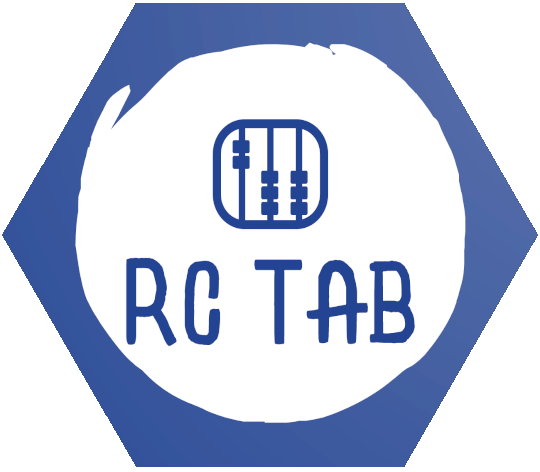

# RCTab API 

The RCTab API webserver.

You can find the full RCTab docs [here](https://rctab.readthedocs.io/), the online API documentation [here](https://rctab-api.readthedocs.io/) and the documentation source code in [docs/](docs/).
